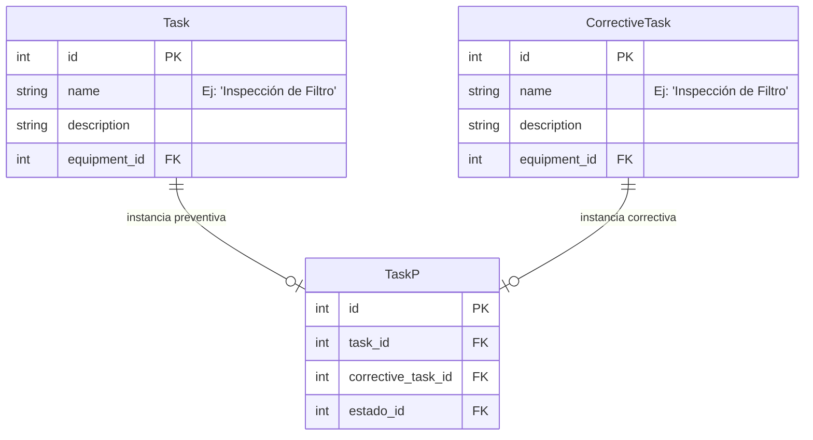
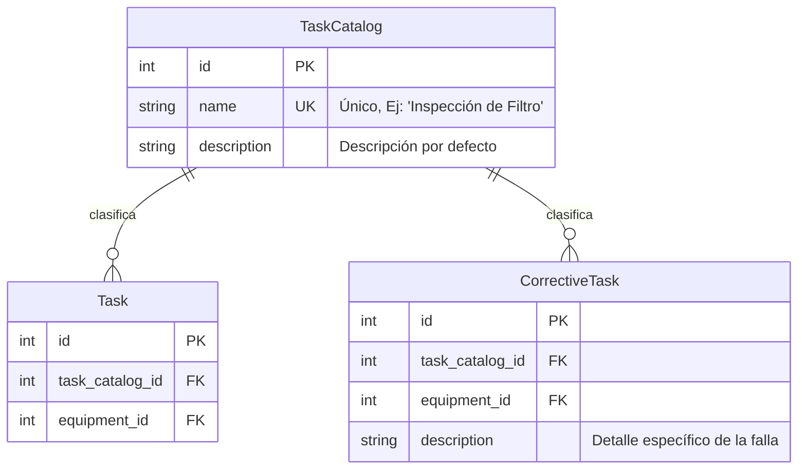

# Análisis de Normalización de Base de Datos: Catálogo de Tareas

Este documento analiza la viabilidad, ventajas, inconvenientes y diseño propuesto para extraer la columna `name` (nombre de la tarea) de las tablas `Task` (Tareas Programadas) y `CorrectiveTask` (Tareas Correctivas) a una nueva tabla catálogo (`TaskCatalog`).

---

## 1. Estado Actual del Modelo

Actualmente, tanto las definiciones de tareas programadas (`Task`) como los reportes de fallas o correctivas (`CorrectiveTask`) almacenan el nombre de la tarea como cadenas de texto libre (`CharField`):



### Problemas del diseño actual:
1. **Redundancia:** El mismo texto (ej. `"Inspección visual de bomba"`) se repite decenas de veces para diferentes equipos y registros correctivos.
2. **Inconsistencia:** Al ser texto libre en correctivas, los usuarios pueden ingresar nombres similares pero diferentes (ej. `"Limpieza de tolva"`, `"Limpieza tolva"`, `"Limp. Tolva"`), dificultando reportes y filtros.
3. **Escalabilidad:** Modificar el nombre de una tarea requiere actualizar múltiples filas.

---

## 2. Propuesta de Normalización: Tabla `TaskCatalog`

Se propone crear una tabla intermedia/catálogo llamada `TaskCatalog` (o `TaskType`) que centralice los nombres únicos de las tareas.



### Definición del nuevo modelo (Django):
```python
class TaskCatalog(models.Model):
    name = models.CharField(max_length=100, unique=True)
    description = models.TextField(null=True, blank=True)

    class Meta:
        verbose_name = "Catálogo de Tareas"
        verbose_name_plural = "Catálogo de Tareas"
        ordering = ['name']

    def __str__(self):
        return self.name
```

---

## 3. Ventajas e Inconvenientes

| Ventajas | Inconvenientes / Desafíos |
| :--- | :--- |
| **Consistencia absoluta:** Los usuarios seleccionan de una lista estandarizada, eliminando errores tipográficos. | **Pérdida de flexibilidad en correctivas:** Las fallas correctivas a veces son muy específicas. Forzar a elegir del catálogo puede ser limitante si no se permite crear nuevos registros dinámicamente. |
| **Reportes cruzados sencillos:** Es muy fácil responder a: *¿Cuántas horas/costos dedicamos a 'Cambio de polines' en preventivo vs correctivo?* | **Complejidad en la migración:** Se requiere crear un script de migración para extraer los nombres existentes, insertarlos en el catálogo y mapear las llaves foráneas. |
| **Eficiencia de almacenamiento:** Menor peso en la base de datos al almacenar IDs enteros (4 bytes) en lugar de cadenas de texto repetidas. | **Modificación del código:** Requiere adaptar serializers, filtros y las consultas coalescidas en el backend (`views.py`), además del autocompletado en el frontend. |
| **Enriquecimiento del catálogo:** Permite añadir campos adicionales al catálogo en el futuro (ej. Categoría: Mecánica/Eléctrica, Especialidad, etc.). | |

---

## 4. Estrategia de Implementación Recomendada (Enfoque Híbrido)

Para no perder la flexibilidad necesaria en las tareas correctivas (donde a veces ocurren imprevistos únicos), se recomienda un enfoque híbrido:

1. **Para Tareas Programadas (`Task`):** Uso obligatorio de la clave foránea a `TaskCatalog`.
2. **Para Tareas Correctivas (`CorrectiveTask`):**
   - Opción A (Sugerida): Mantener el campo `name` como texto libre, pero en la interfaz de usuario (frontend) ofrecer un **buscador con autocompletado** alimentado por `TaskCatalog`. Si la tarea correctiva calza con una del catálogo, se asocia (mediante un campo `task_catalog_id` opcional). Si es un imprevisto muy raro, el usuario puede simplemente escribir el texto libre.
   - Opción B (Estricta): La tarea correctiva debe pertenecer obligatoriamente al catálogo, pero el sistema permite al usuario añadir nuevas tareas al catálogo "al vuelo" desde el mismo formulario si cuenta con los permisos necesarios.

---

## 5. Plan de Migración de Datos (Pasos)

Si decides seguir adelante con este cambio, este sería el proceso de migración de la base de datos:

1. **Creación del Modelo:** Agregar `TaskCatalog` y los campos de llave foránea (`task_catalog_id`) a `Task` y `CorrectiveTask`.
2. **Migración de Datos (Script Python):**
   - Recorrer todas las filas de `Task` y `CorrectiveTask`, obteniendo sus valores únicos de `name`.
   - Crear un registro en `TaskCatalog` para cada nombre único.
   - Mapear y guardar la relación de llave foránea en `Task` y `CorrectiveTask` apuntando al ID creado.
3. **Eliminar Columnas Antiguas:** Una vez verificada la relación, realizar una migración para eliminar el campo de texto libre `name` original de `Task` (y de `CorrectiveTask` si se opta por el modelo estricto).
4. **Actualización de Código:** Ajustar los serializers y consultas JOIN en Django para que usen `task__task_catalog__name`.
